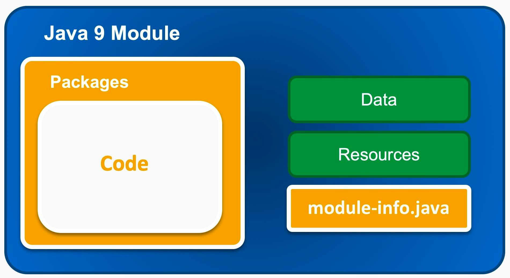
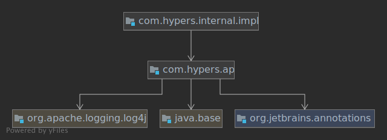

<!-- .slide: class="center" -->
## 模块化系统



---
<!-- .slide: class="center" -->

### 模块化的优势

- 减少打包体积
- 改变应用发布方式
- 使大型项目代码更易维护
- 更强的封装
- 显式的依赖
- 一定程度上避免 classpath hell

---

<!-- .slide: class="center" -->

### `module-info.java`

```java
module com.hypers.api {
  // 依赖模组
  requires java.base;
  requires org.jetbrains.annotations;
  // 导出，对外暴露
  exports com.hypers.api;
  // 限定导出
  exports com.hypers.internal.api to com.hypers.internal.impl;
  // 开放模组，允许反射
  opens com.hypers.internal.impl /* to xxx*/;
  // 可以注册的服务
  uses com.hypers.api.Tool;
  // 通过ServiceLoader可以发现的注册服务
  provides com.hypers.api.Tool 
      with com.hypers.internal.impl.SimpleTool;
}
```

---

<!-- .slide: class="center" -->



---
<!-- .slide: class="center" -->

### Named Module

- 带有 *module-info.java*
- 模块化的包都有名字
- 如果JAR包放在module-path下变成 *Automatic Module*
  - 使用 `Automatic-Module-Name`
  - 默认导出所有包
  - 默认依赖所有包

---
<!-- .slide: class="center" -->

### Unnamed Module

- 所有classpath下的JAR都组成无名模块
- 旧的非模块化的包都在"无名模块"下
- 无名模块可以访问所有模块
- 默认 `--illegal-access=permit`
- 有名模块不能访问无名模块

---
<!-- .slide: class="center" -->

## 安装包体积大幅下降

🔖 没有JRE 没有32位

最小的HelloWorld可执行程序可以做到40MB
