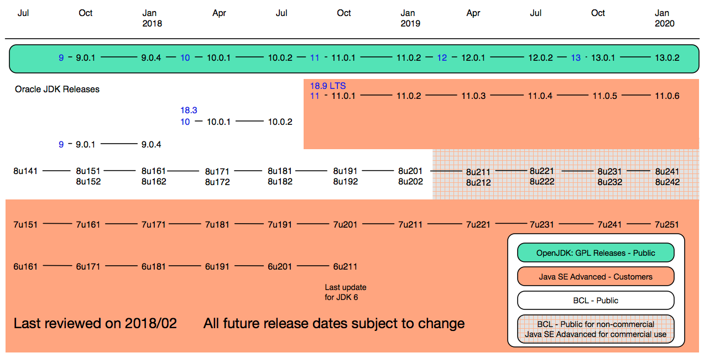
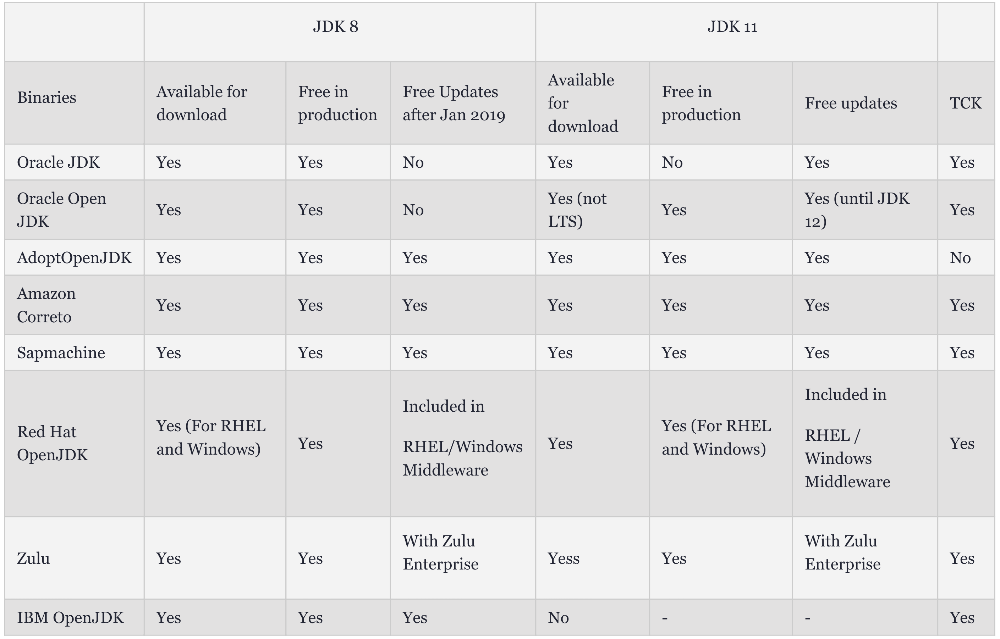

## 许许多多的版本

不是每年都有新版本

- JDK 6: 2006-12，距离JDK5发布2年2个月
- JDK 7: 2011-07，间隔4年8个月
- JDK 8: 2014-03，间隔2年8个月
- JDK 9: 2017-12，间隔3年6个月

---
<!-- .slide: class="center" -->

## Java 平台的特点

### 稳定

### 安全

### 免费

---
<!-- .slide: class="center" -->

- ✅ 有充足的时间迁移

- ✅ 向后兼容 基本无需修改代码

- ⚠️ 等待所有特性开发完成再发布

- ⚠️ 新功能需要时间沉淀

---

### 新发布模式

每年都有两个新版本

- JDK 10: 2018-03
- JDK 11: 2018-09 (LTS)
- JDK 12: 2019-03
- JDK 13: 2019-09
- JDK 14: 2019-09
- JDK 17: 2021-09 (LTS)

新功能一经完成便发布

---
<!-- .slide: class="center" -->

---
<!-- .slide: class="center" -->

## 同时有很多可选项

- Orcale JDK
- OpenJDK
- AdoptOpenJDK
- Azul
- ...

---

### 长期支持版本

- 为每个发行版提供长期支持是不现实的
  - JDK9、JDK10被称为特性发行版

- JDK8及以前的所有发行版都分类为LTS
  - JDK8将于2019-01停止对企业用户的免费支持
  - 个人用户的更新将持续到2020-12

- 今后每3年一个LTS
  - 每6个月一个发行版

---

### 不再“免费”

- Orcale JDK对企业用户开始收费
  - 桌面版 $2.5/月 服务器 $25/月
- 开发、测试、演示依然免费
- 商业功能逐渐开源
  - Flight recorder
  - Mission control
- OpenJDK 继续保持免费
- OpenJDK 每个版本只有六个月支持期
  - 每三个月一次 总共两次

🔖 DockerHub提供部署时所需的旧版本
<!-- .element: class="fragment" -->

---

