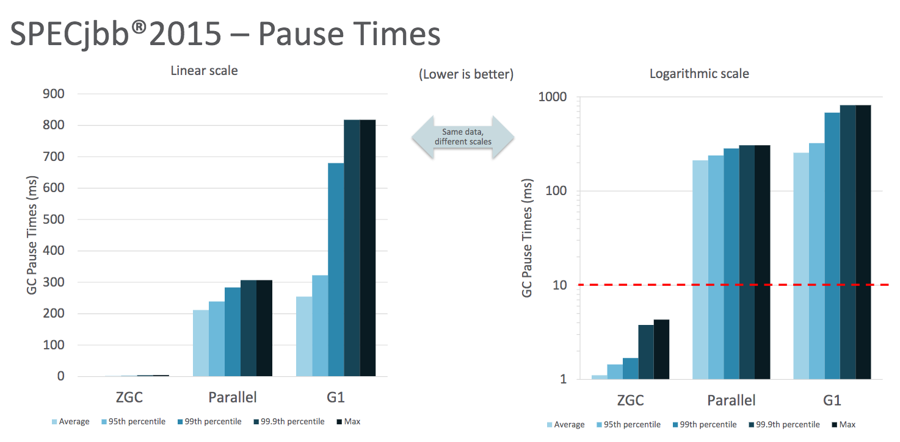

## 字符串性能提升

压缩字符串

```java
public final class String {
    /**
     * The value is used for character storage.
     */
    private final byte[] value;
    
    /**
     * The identifier of the encoding used to
     * encode the bytes in {@code value}.
     * The supported values in this implementation are
     * LATIN1 / UTF16
     */
    private final byte coder;
```

String: `char[]` => `byte[]` (with encoding)

------

<!-- .slide: class="center" -->
## 虚拟机性能提升

- JEP-143 改善锁争用机制
- JEP-197 代码分段缓存
- JEP-310 应用类数据共享

---

### 垃圾收集器

默认使用G1回收器


- 可预测的停顿时间
- 不产生内存碎片

---

- JEP-307 并行的 Full GC
- 相比Java8 G1 和 并行 GC 分别有 16.1% 和 4.5% 的提升


---

### 试验性的ZGC



<https://cr.openjdk.java.net/~pliden/slides/ZGC-FOSDEM-2018.pdf>

---

<div class="tweet" data-src="https://twitter.com/0xd33d33/status/1034722011032027136"></div>

---


不断分配内存空间并且一同释放

<https://ionutbalosin.com/2019/12/jvm-garbage-collectors-benchmarks-report-19-12/>
