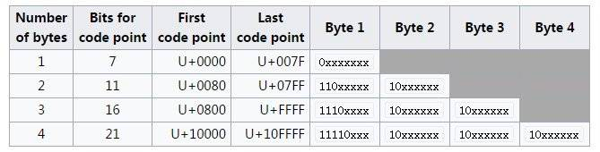

## 在接口内定义方法

- Java 7只允许 `public abstract` 方法

- Java 8允许 `public static`, `public default`

- Java 9允许 `private static`, `private method`

```java
public interface CustomCalculator {
  default int addEvenNumbers(int... nums) {
    return add(this::isEven, nums);
  }
  
  private boolean isEven(int n) { return n % 2 == 0; }
  
  private static int add(IntPredicate predicate, int... nums) {
    return IntStream.of(nums).filter(predicate).sum();
  }
}
```

------

## 变量定义

假设我们有一个叫`Function`的泛型接口
它有一个`List<String> apply(String)`方法
用于将字符串中按字符拆成列表。

```java
interface Function<T, R> {

  @NotNull R apply(@NotNull T t);
}
```

---

### Java 6

使用匿名类

```java
Function<String, List<String>> function =
  new Function<String, List<String>>() {
  public List<String> apply(@NotNull String s) {
    List<String> strings = new ArrayList<String>();
    int length = s.length(), offset = 0;
    while (offset < length) {
      int codepoint = s.codePointAt(offset);
      strings.add(String.valueOf(Character.toChars(codepoint)));
      offset += Character.charCount(codepoint);
    }
    return strings;
  }
};
```

---

### Java 7

提供菱形语法根据前面的声明进行类型推断

```diff
Function<String, List<String>> function =
  new Function<String, List<String>>() {
  public List<String> apply(@NotNull String s) {
-   List<String> strings = new ArrayList<String>();
+   List<String> strings = new ArrayList<>();
    int length = s.length(), offset = 0;
    while (offset < length) {
      int codepoint = s.codePointAt(offset);
      strings.add(String.valueOf(Character.toChars(codepoint)));
      offset += Character.charCount(codepoint);
    }
    return strings;
  }
};
```

但是不支持在匿名类上使用
<!-- .element: class="fragment" -->

---

### Java 8 提供Lambda表达式语法

```java
Function<String, List<String>> function = new Function<String, List<String>>() {
  public List<String> apply(@NotNull String s) {
    List<String> strings = new ArrayList<>();
    int length  = s.length(), offset = 0;

    Function<Integer, Integer> codePointAt      = s::codePointAt;
    Function<Integer, char[]>  codePointTo16Bit = Character::toChars;
    Function<char[], String>   arrayToString    = String::valueOf;
    Function<String, Integer>  appendToList     = (w) -> {strings.add(w); return w.codePointAt(0);};
    Function<Integer, Integer> moveMetric       = Character::charCount;

    while (offset < length) {
      var charOffset = appendToList
          .compose(arrayToString)
          .compose(codePointTo16Bit)
          .compose(codePointAt).apply(offset);
      var charOffset2 = codePointAt
          .andThen(codePointTo16Bit)
          .andThen(arrayToString)
          .andThen(appendToList).apply(offset);
      offset += moveMetric.apply(charOffset);
    }
    return strings;
  }
};
```
<!-- .element: class="stretch" -->

---
<!-- .slide: class="center" -->

更提供了 _Stream_ 以流的方式处理元素

```java
Function<String, List<String>> function = s -> s
    .codePoints()
    .mapToObj(Character::toChars)
    .map(String::valueOf)
    .collect(Collectors.toList());
```

---

### Java 11

类型推断
提供 `var` 类型

```java
var name = "Java 11";
var chars = name.toCharArray();
for (var ch : chars) {
  System.out.println(ch);
}
```

但是以下不会编译
<!-- .element: class="fragment" data-fragment-index="1" -->
```java
var number;
var someList = null;
var isLongString = (String s) -> s.length() > 10;
var a = 1, b = 2;
var array = {1, 2, 3};
```
<!-- .element: class="fragment" data-fragment-index="1" -->

⚠️ `var` 不是关键字 即可以有 `var var = 1`  
⚠️ `var list = new ArrayList<>()` 会推断出Object
<!-- .element: class="fragment" -->

---

### 特殊用法

匿名对象 (Kotlin)

```java
var anonymous = new Object() {

  void processFile() {
    async.openFile(this::secondCallback);
  }

  void secondCallback(File file) {
    // check file properties
    async.processFile(this::thirdCallback);
  }

  void thirdCallback(File file) {
    // do on file
  }
};

anonymous.processFile();
```

---

交集类型 (Scala)

```java
static <T extends Closeable & Appendable>
T appendTo(T supplier) throws IOException {
  try (supplier) {
    supplier.append('m');
  }
  return supplier;
}


static void myExample() throws IOException {
  var example1 = appendTo((Closeable & Appendable) new StringWriter());
  var example2 = appendTo(new StringWriter());
  example1.close();
  example2.close();
}
```

---
<!-- .slide: class="center" -->

```java
Function<String, List<String>> function = s -> s
    .chars()
    .mapToObj(Character::toString)
    .collect(Collectors.toList());
var result = function.apply("😂你再说");

// [?, ?, ?, ?, ?, ?, 说]
```

因为 Unicode 已经超过16bit的表示范围
<!-- .element: class="fragment" data-fragment-index="1" -->


<!-- .element: class="fragment" data-fragment-index="1" -->

---
<!-- .slide: class="center" -->

```diff
Function<String, List<String>> function = s -> s
    .codePoints()
-   .mapToObj(Character::toChars)
-   .map(String::valueOf)
+   .mapToObj(Character::toString)
    .collect(Collectors.toList());
var result = function.apply("😂你再说");

// [😂, 你, 再, 说]
```

<https://github.com/minimaxir/big-list-of-naughty-strings>

---
<!-- .slide: class="center" -->

允许在Lambda表达式中使用var省略显式类型声明

```java
List<Map<String, Integer>> types = /* ... */;

types.stream()
    // this is fine, but we need @NonNull on the type
    .filter(type -> check(type))
    // in Java 10, we need to do this ~> ugh!
    .filter((Map<String, Integer> type) -> check(type))
    // in Java 11, we can do this ~> better
    .filter((@NotNull var type) -> check(type));
```

💎菱形操作符(`<>`)也能在匿名类上使用

```java
Supplier<Integer> supplier = new Supplier<>() { ... };
```

------
<!-- .slide: class="center" -->

## 集合操作

为创建集合添加了许多方便的静态方法

```java
List.of("a", "b", "c");
Set.of("a", "b", "c");
Map.of("a", 1, "b", 2, "c", 3);
List.copyOf(new ArrayList<>());
```

同时也是不可变集合

------
<!-- .slide: class="center" -->

## Optional

Optional.ifPresentOrElse()

```java
String redirect = config.getRedirect();
if (Boolean.parseBoolean(redirect)) {
  System.out.println("redirect to backend");
} else {
  System.out.println("nothing get redirected");
}

Optional.ofNullable(config.getRedirect())
    .map(Boolean::valueOf)
    .ifPresentOrElse(
        (e) -> System.out.println("redirect to backend"),
        ( ) -> System.out.println("nothing get redirected"));
```

---

Optional.or()

```java
var config       = new Config();
var secondConfig = new Config();
String configStr = config.getRedirect();
if (configStr == null) {
  configStr = secondConfig.getRedirect();
}
if (Boolean.parseBoolean(configStr)) {
  System.out.println("redirect to backend");
} else {
  System.out.println("nothing get redirected");
}

Optional.<String>empty()
    .or(() -> Optional.ofNullable(config.getRedirect()))
    .or(() -> Optional.ofNullable(secondConfig.getRedirect()))
    .map(Boolean::valueOf)
    .ifPresentOrElse(
        e -> System.out.println("redirect to backend"),
        () -> System.out.println("nothing get redirected"));
```
<!-- .element: class="stretch" -->

------

## 改进后的 try-with-resource

资源在使用后需要适时被释放

比如Java 6

```java
Closeable closeable = null;
try {
  closeable = new StringReader("something");
  // use resource
} finally {
  if (closeable != null) {
    closeable.close();
  }
}
```

⚠️ `close()` 也可能会抛出异常
<!-- .element: class="fragment" data-fragment-index="1" -->

---

### Java 7
提供AutoCloseable接口

```java
try (AutoCloseable closeable = new StringReader("something")) {
    // use resource
}
```

⚠️ 如果在关闭时抛出异常 \
会放在 `java.lang.Throwable.getSuppressed` 中
<!-- .element: class="fragment" -->

---

### Java 9

如果已经有一个资源变量，且它是`final`的 \
可以直接使用

```java
AutoCloseable closeable = new StringReader("something");
try (closeable) {
  // use resource
}
```


------

## Deprecated包含更多语义

Java 9之后可以为 `@Deprecated` 指定

废弃开始的版本以及是否在将来移除

```java
@Deprecated(since = "2020-01-01", forRemoval = true)
```
